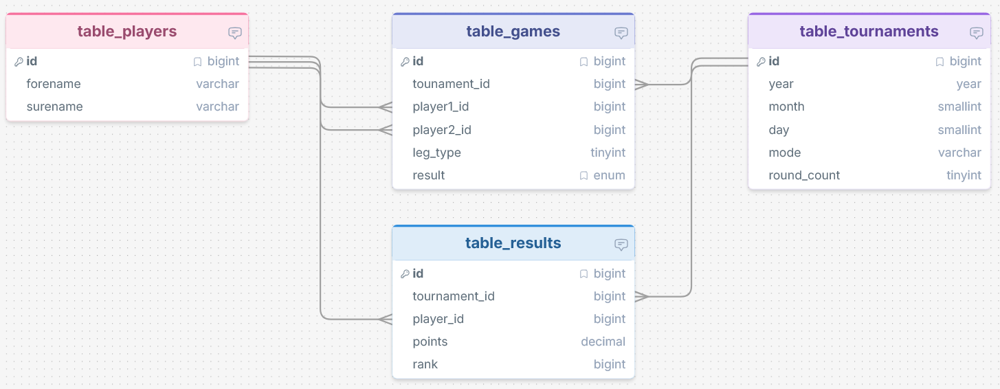

# Monatsblitz Plugin

A lightweight WordPress plugin to manage blitz chess tournaments through a REST API.

## Motivation

We are both board members in different clubs. Balancing work, family, and volunteering means one thing: time is our most limited resource.
At the same time, a well-maintained website is a key factor for attracting members and creating a strong public presence. In a chess club, activity is most visible through regular results and tournament reports.

This is exactly where the problem starts:
- Results are often only written on paper
- The sheet is somewhere, and someone took it home
- It gets shared in chat but is never found again
- Posting a photo in WordPress looks unprofessional
- Writing news posts manually takes unnecessary time every time

In our chess club, we have around two round-robin tournaments per month. Members care about the results, and they also show outsiders that the club is active. But maintaining everything manually is tedious and error-prone.

That led to a simple idea:

Why not capture results digitally right away and let WordPress generate the posts automatically?

The solution has two parts:
1. WordPress plugin
It automatically creates news posts as soon as new results are available.
No copy-paste work, no paper sheets, no lost information.

2. Mobile app
All members can enter results directly on their phones.
Paper is no longer needed, and the data goes straight where it belongs.

This solves several problems at once:
- No more paper sheets
- No searching for photos or chat messages
- Results are published immediately
- The website stays up to date and professional
- We save time without sacrificing content
- Members instantly see what is happening in the club

In short:
We automate the boring parts so there is more time for what really matters in club life.

## What the Plugin Does

- Creates the required tables on activation:
  - `wp_monatsblitz_players`
  - `wp_monatsblitz_tournaments`
  - `wp_monatsblitz_games`
  - `wp_monatsblitz_results`
- Provides REST API endpoints for managing players, tournaments, games, and results.
- Creates a new published post from an existing `Template_Monatsblitz` post once a tournament is finalized.
- Creates or updates a yearly static page (slug `blitz-YYYY`) from a configured page template.
- Replaces template placeholders such as `{{month_name}}`, `{{year}}`, `{{date}}`, `{{winner_name}}`, `{{winner_games}}`, `{{winner_points}}`, `{{table}}`, and more.

## Usage

1. Place the plugin in `wp-content/plugins/monatsblitz`.
2. Activate it in the WordPress admin.
3. Create a post titled `Template_Monatsblitz` and use it as a template.
   - The template can include HTML, Kadence blocks, and CSS.
   - Placeholders are replaced during the finalize call.
4. Your app or an external system uses the API to store tournament data.
5. After all results are complete, call `POST /wp-json/monatsblitz/v1/finalize`.
6. The plugin creates a new published post with the formatted results.

## REST API

Base path: `/wp-json/monatsblitz/v1`

### Players

- `POST /player`
  - Creates a new player or returns the ID if the player already exists.
  - Alternatively accepts a batch payload via `players` or a top-level array.
  - Body (JSON):
    - `forename`: first name
    - `surname`: last name
  - Batch format:
    - `players`: array of objects with `forename`, `surname`
    - or a top-level array with the same objects
  - Behavior:
    - Single JSON requests are still supported.
    - Batch requests are validated and stored per player.
    - Invalid batch data returns `WP_Error` with HTTP 400.
  - Batch response:
    - `success`: `true`
    - `count`: number of processed players
    - `items`: list of per-player responses

  - Example (anonymized):

```json
[
  { "forename": "Alex", "surname": "Meyer" },
  { "forename": "Chris", "surname": "Schulz" }
]
```

```json
{
  "success": true,
  "count": 2,
  "items": [
    { "success": true, "player_id": 301 },
    { "success": true, "player_id": 302 }
  ]
}
```

- `GET /players`
  - Returns all players.

### Tournaments

- `POST /tournament`
  - Creates a new tournament.
  - Body (JSON):
    - `date`: date in format `YYYY-MM-DD`
    - `mode`: tournament mode (for example `3+5`, `5+0`)
    - `round_count` (optional): number of rounds, default `1`

- `GET /tournaments`
  - Returns all tournaments.

- `GET /tournament/{id}`
  - Returns tournament details for a given ID.

### Games

- `POST /game`
  - Creates a game.
  - If `game_id` is provided, updates an existing game.
  - `PUT /game` is also supported for updates.
  - Alternatively accepts a batch payload via `games`.
  - Body (JSON):
    - `game_id` (optional): existing game ID for updates
    - `tournament_id`
    - `player1_id`
    - `player2_id`
    - `leg_type` (optional): round/leg number, default `1`
    - `result` (`1-0`, `0-1`, `0.5-0.5`)
  - Behavior:
    - Player IDs are normalized before storing: `player1_id <= player2_id`.
    - If IDs are swapped during normalization, the result is mirrored (for example `1-0` becomes `0-1`).
  - Batch format:
    - `tournament_id`
    - `games`: array of objects with `player1_id`, `player2_id`, `result`, `leg_type`
  - Behavior:
    - Single JSON requests are still supported.
    - Batch requests are validated and stored per game.
    - Invalid batch data returns `WP_Error` with HTTP 400.
  - Batch response:
    - `success`: `true`
    - `count`: number of processed games
    - `items`: list of per-game responses

  - Example (anonymized):

```json
{
  "tournament_id": 3,
  "games": [
    { "player1_id": 1, "player2_id": 8, "result": "1-0", "leg_type": 1 },
    { "player1_id": 1, "player2_id": 8, "result": "0-1", "leg_type": 2 }
  ]
}
```

```json
{
  "success": true,
  "count": 2,
  "items": [
    { "success": true, "game_id": 201 },
    { "success": true, "game_id": 202 }
  ]
}
```

- `GET /games/{tournament_id}`
  - Returns all games for a tournament.

### Results

- `POST /result`
  - Creates or updates a player's result in a tournament.
  - Alternatively accepts a batch payload via `results`.
  - Body (JSON):
    - `tournament_id`
    - `player_id`
    - `points`
    - `rank`
  - Batch format:
    - `tournament_id`
    - `results`: array of objects with `player_id`, `points`, `rank`
  - Behavior:
    - Single JSON requests are still supported.
    - Batch requests are validated and stored per result.
    - Invalid batch data returns `WP_Error` with HTTP 400.
  - Batch response:
    - `success`: `true`
    - `count`: number of processed results
    - `items`: list of per-result responses

  - Example (anonymized):

```json
{
  "tournament_id": 3,
  "results": [
    { "player_id": 5, "points": 8, "rank": 1 },
    { "player_id": 3, "points": 6, "rank": 2 },
    { "player_id": 1, "points": 3, "rank": 3 }
  ]
}
```

```json
{
  "success": true,
  "count": 3,
  "items": [
    { "success": true, "result_id": 101 },
    { "success": true, "result_id": 102 },
    { "success": true, "result_id": 103 }
  ]
}
```

- `GET /results/{tournament_id}`
  - Returns all results for a tournament.

### Finalization

- `POST /finalize`
  - Creates or updates a published post from the configured template post.
  - Body (JSON):
    - `tournament_id`

- `POST /buildYearPage`
  - Creates or updates the yearly static page for a given year.
  - Body (JSON):
    - `year`

- `POST /recreatePosts`
  - Recreates all tournament posts by iterating over all stored tournaments.
  - For each tournament, it triggers the same finalize logic as `POST /finalize`.
  - Body (JSON): none
  - Response (JSON):
    - `processed`: number of tournaments found
    - `succeeded`: number of successfully recreated posts
    - `failed`: number of tournaments that failed during finalize
    - `errors`: per-tournament error details

- Important:
  - The post is published immediately.
  - Existing monthly posts are updated if a post with meta key `blitz-YYYY-MM-DD` already exists.
  - The title is created in the format `Monatsblitz YYYY-MM-DD`.
  - Template placeholders are replaced.
  - If `round_count = 1`, `{{table}}` contains the classic cross table including points and rank.
  - If `round_count > 1`, `{{table}}` contains one cross table per round (without points/rank), followed by an overall table with player name, total points, and rank.

## Database Schema

The project uses a relational data model specifically designed for Monatsblitz tournament requirements.

The database consists of four tables:
- monatsblitz_players: player management
- monatsblitz_tournaments: tournament metadata
- monatsblitz_games: all played games
- monatsblitz_results: final results per player and tournament

The full schema is shown in the following diagram:



(Note: The diagram was created with drawSQL.)

### Design Principles

#### Uniqueness via constraints

- monatsblitz_players: UNIQUE(forename, surname)
- monatsblitz_tournaments: UNIQUE(year, month, day)
- monatsblitz_games: UNIQUE(tournament_id, player1_id, player2_id, leg_type)
- monatsblitz_results: UNIQUE(tournament_id, player_id)

#### Flexible number of rounds
The `round_count` field in the tournament table supports any number of legs (1 = single round, 2 = home/away style double round, and so on).

#### Explicit round indicator
Each game has a `leg_type` field (1, 2, 3, ...) indicating which round/leg it belongs to.

#### WordPress compatibility
The schema is fully compatible with `dbDelta()` and intentionally avoids foreign keys.

## Template Placeholders

In the `Template_Monatsblitz` post, you can use these placeholders:

- `{{month_name}}` - full month name
- `{{year}}` - year
- `{{date}}` - date in format `DD.MM.YYYY`
- `{{winner_name}}` - winner name
- `{{winner_games}}` - number of games played by the winner
- `{{winner_points}}` - winner points
- `{{ranking_rows}}` - HTML rows for the ranking table
- `{{games_list}}` - simple list of games
- `{{table}}` - full cross table in HTML format
- `{{mode}}` - tournament mode
- `{{round_count}}` - number of rounds

For yearly static pages, these placeholders are supported:

- `{{blitz_monthly_overview}}` - HTML table for months 1-12 with participations and points per player
- `{{blitz_ranking_year}}` - yearly ranking table using the best 7 participations
- `{{year}}` - the year of the blitz tournament

Yearly overview behavior:

- Option `monatsblitz_hide_january_overview`: if enabled, January (month `1`) is not shown in `{{blitz_monthly_overview}}`.
- Month cells in `{{blitz_monthly_overview}}` show only points when a player participated.
- If a player did not participate in a month, the cell is empty (instead of `0/0`).

## Security

The API is protected by an API key that must be sent in the request header. The key can be generated in the plugin settings and must be configured in the related app.

## Note

The domain `https://kindermaenner.de` is not hardcoded in the plugin. It works independently of the site address and uses WordPress internal paths and URLs.
